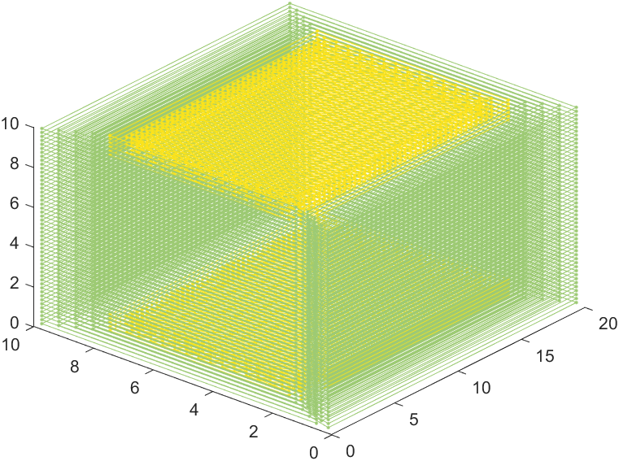
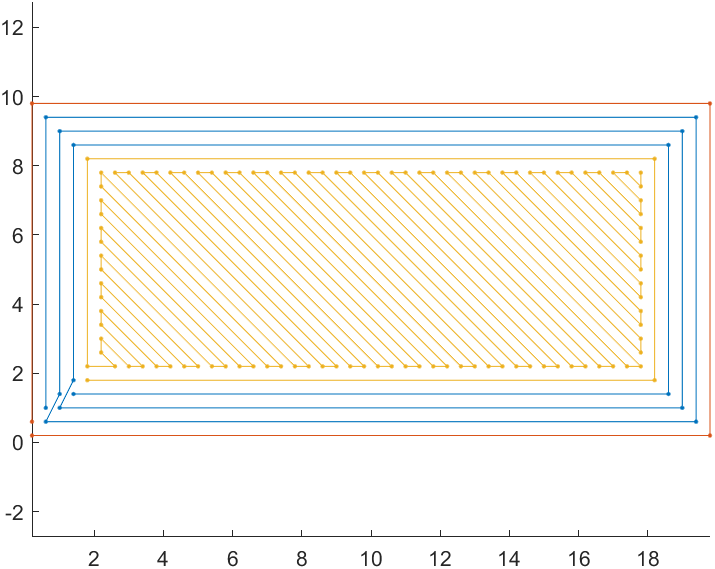

# Cubic-slicer

Данный проект выполняет слайсинг кубика. Учитиваются: диаметр спола, толщина слоя, толщина стенок.
Для сборки проекта используется CMake + MinGw gcc.
Для успешной сборки необходима библиотека Eigen.
---
В данной версии реализовано:
- разбиение прямоугольного параллелипипеда на слои
- генерация траектории стено по их толщине
- генерация 100% заполнения для первых и последних слоёв методом зиг-заг

# Сборка
- Склонируйте репозиторий в рабочее пространство
`git clone https://github.com/RealEndCutter/Cubic-slicer.git `
`cd Cubic-slicer`
- Создайте папку для сборки
`mkdir build && cd build`
- Сконфигурируйте проект
`cmake ..`
- Соберите проект
`cmake --build .`

# Запуск
В папке **build** запустите исполняемый файл **sliser.exe**, используя следующую команду:
`. sliser.exe`

---
На данный момент проект требует отладки. Однако алгоритм работает. Результат его работы приведен на рисунке. Данный алгоритм написан на **Matlab**.

---
- В дальнейшем планируется добавить графический интерфейс (GUI) с помощью QT
- Возможность анимированного вывода траектории движения рабочего инструмента

